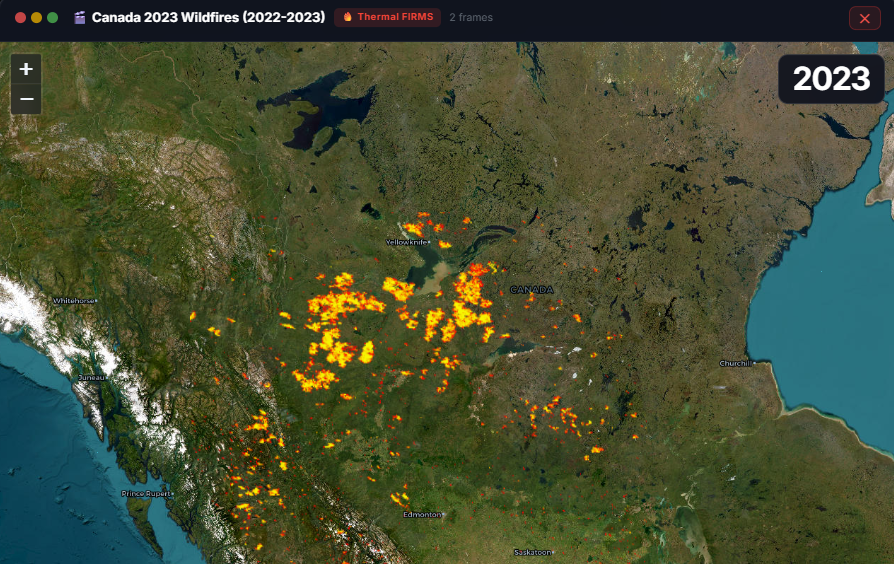
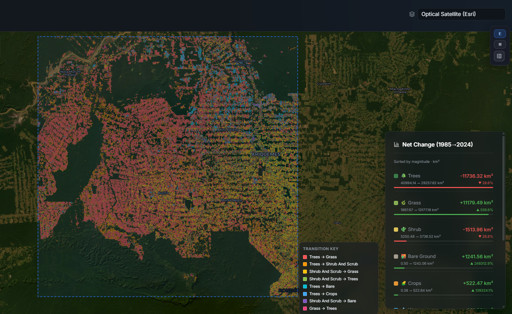

# 🌍 Earth Surface Dynamics

A comprehensive web-based tool for monitoring and analyzing Earth surface changes using satellite imagery and geospatial analysis. This project leverages Google Earth Engine and interactive visualization to track landscape transformations including wildfires, urban expansion, deforestation, and land-use changes.


Dubai's Coast artificial urban expansion over time (RGB time-lapse).

## Motivation

I built this project because the scale of human impact on the planet can be hard to grasp. I wanted a simple way to show how much the Earth has changed over the past decades and make those changes easier to share with others.

## 📸 Showcase

### Wildfire Monitoring

*Thermal FIRMS data showing wildfire hotspots and intensity*

### Shanghai Change Map

*Urban and land-use change around Shanghai from 1995 to 2024.*


### Change and Diff Maps (Side by Side)
<table>
  <tr>
    <td align="center">
      
    </td>
    <td align="center">
      
    </td>
  </tr>
</table>
*Left: Pearl River Delta transition map. Right: Rondonia deforestation diff map.*


### Amazon River Mining Scars (SAR Time-Lapse)
.gif)
*Radar time-lapse showing mining-driven landscape disturbance along river corridors.*

### Nile Delta Nighttime Lights (Time-Lapse)
.gif)
*Night lights growth as a proxy for human activity and infrastructure expansion.*

### Rondonia Time-Lapses (Side by Side)
<table>
  <tr>
    <td align="center">
      
    </td>
    <td align="center">
      
    </td>
  </tr>
</table>
*Left: NDVI vegetation signal over time. Right: RGB progression of forest fragmentation and settlement expansion.*

## Features

### 📊 Interactive Satellite Visualization
- Compare the same place across different years.
- See big changes like fires, city growth, water, and vegetation shifts.
- Use maps and timelines to make the changes easier to understand.

### 🛰️ Google Earth Engine Integration
- Pulls in satellite and land-cover data from Google Earth Engine.

### 🔍 Advanced Analysis
- Shows where the land changed and how much it changed.

## Datasets Used

I use Google Dynamic World V1, Landsat, Sentinel-2 SR Harmonized, MODIS MCD12Q1, VIIRS Nighttime Lights, FIRMS, Sentinel-1, and JRC Global Surface Water.

### Interactive Exploration Tools
- Browse events, move around the map, and step through time-lapse views.

## System Overview

- **Frontend (`frontend/`)**: React + Leaflet map UI for exploring events, time-lapses, and change maps.
- **Backend (`backend/`)**: FastAPI service that pulls Google Earth Engine data, computes land-change outputs, and serves tiles/analysis.
- **Project layout**: `configs/` for settings, `tests/` for validation, and `assets/` for showcase media.
- **Key API routes**: `POST /predict/layout`, `POST /predict/layout-change`, `POST /gee/layout`, `POST /gee/layout-change`, `POST /gee/layout-timeseries`, `POST /gee/satellite-timeseries`, `POST /gee/timelapse-gif`, and `GET /health`.
- **Typical flow**: choose an area + years in the frontend → call backend route → render map layers, stats, and visuals.

## Getting Started (Usage)

### Prerequisites
- Python 3.9+
- Node.js 16+
- Google Earth Engine account and credentials
- Git

### Installation

1. **Clone the repository**
```bash
git clone <repository-url>
cd "Earth Surface Dynamics"
```

2. **Set up Python environment**
```bash
python -m venv .venv
source .venv/bin/activate  # On Windows: .venv\Scripts\activate
pip install -r requirements.txt
```

3. **Set up frontend**
```bash
cd frontend
npm install
```

4. **Configure Google Earth Engine credentials**
```bash
earthengine authenticate
```

5. **Update configuration**
Edit `configs/default.yaml` with your specific settings and data paths.

### Running the Application

**Terminal 1 - Backend Server:**
```bash
cd backend
python main.py
# or with uvicorn
uvicorn main:app --reload --port 8000
```

**Terminal 2 - Frontend Development Server:**
```bash
cd frontend
npm run dev
# Runs on http://localhost:5173
```

**Production Build:**
```bash
cd frontend
npm run build
```

## Deploy on Render

- Create one Render web service for the backend and one static site for the frontend.
- Backend start command: `uvicorn backend.main:app --host 0.0.0.0 --port $PORT`
- Frontend build command: `npm install && npm run build`
- Set `VITE_API_BASE_URL` on the frontend to your backend URL, for example `https://your-backend.onrender.com`.
- Add Earth Engine credentials on Render as `GEE_PROJECT_ID` and `GEE_SERVICE_ACCOUNT_JSON`.
- The backend can read either a credentials file path or raw JSON from `GEE_SERVICE_ACCOUNT_JSON`.


## Testing

Run the test suite:
```bash
pytest tests/
```

**Test Coverage:**
- Landsat dataset validation
- Change detection accuracy

## 📦 Dependencies

### Backend
- numpy>=1.25.0
- fastapi>=0.111.0
- uvicorn>=0.30.0
- earthengine-api>=1.1.0
- Pillow>=10.0.0
- requests>=2.31.0

### Frontend
- react@18.3.1
- leaflet@1.9.4
- recharts@3.8.1
- axios@1.7.2

## Contributing

Contributions are welcome! Please follow these steps:
1. Fork the repository
2. Create a feature branch (`git checkout -b feature/AmazingFeature`)
3. Commit your changes (`git commit -m 'Add some AmazingFeature'`)
4. Push to the branch (`git push origin feature/AmazingFeature`)
5. Open a Pull Request

## Acknowledgments

- **Google Earth Engine** for satellite data access

## Contact & Support

For questions, issues, or collaboration opportunities, please open an issue on GitHub or contact me at yosftag2000@gmail.com.
